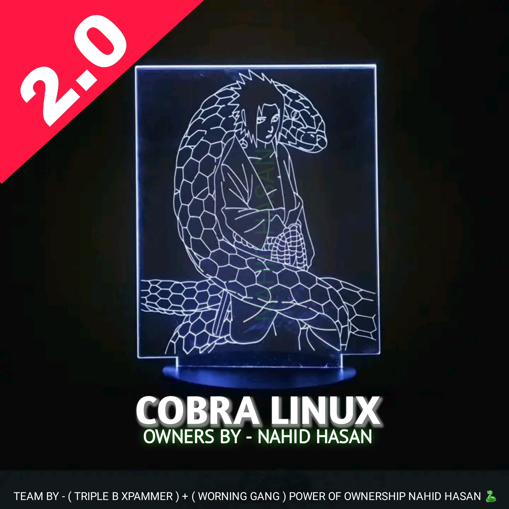
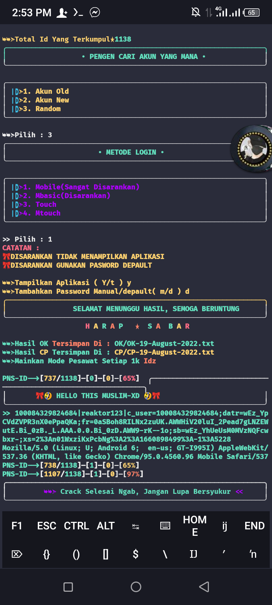
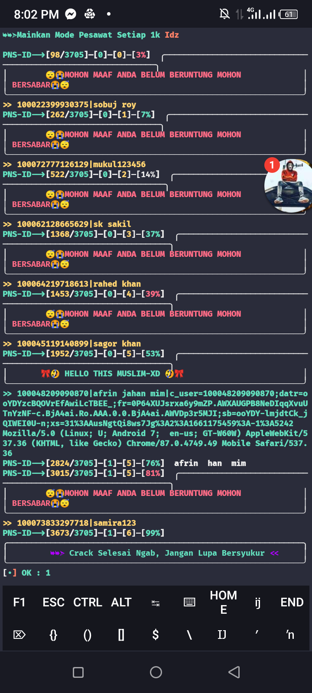
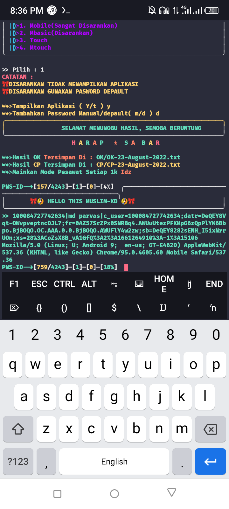

<h1 align=center>COBRA LINUX 2.0</h1>

## install to copy 👇

     rm -rf COBRA-LINUX-2.0
     pip install bs4
     pkg install espeak
     pip install espeak
     pip install mpv
     pip install rich
     pip install --upgrade
     pkg install robot
     pip install --robota
     pkg install python
     pkg install git
     git clone https://github.com/NAHID-AFRIDY/COBRA-LINUX-2.0
     cd COBRA-LINUX-2.0
     python nahid.py

## All Time Run Command 👇

     cd COBRA-LINUX-2.0
     python nahid.py

## How To Ues The Tools 👇
[YOUTUBE TUTORIAL](https://youtu.be/athpdMCVivg)

## IDz Collection Proof 👇

     
